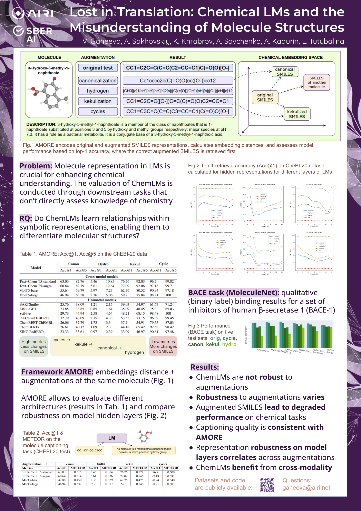

<h3 align="center"> Lost in Translation: Chemical LMs and the Misunderstanding of Molecule Structures </h3>
<p align="center">
  📃 Paper from EMNLP 2024 findings <br>
</p>

## Abstract
The recent integration of chemistry with natural language processing (NLP) has advanced drug discovery. Molecule representation in language models (LMs) is crucial in enhancing chemical understanding. We propose Augmented Molecular Retrieval (♡AMORE), a flexible zero-shot framework that assesses trustworthiness of Chemical LMs of different natures: trained solely on molecules for chemical tasks
and on a combined corpus of natural language texts and string-based structures. The framework relies on molecule augmentations that preserve an underlying chemical, such as kekulization and cycle replacements. The metric is based on the similarity score between distributed representations of molecules and their augmentations. 




## Experimental datasets
Experimental datasets are provided in the folder "data". CHEBI-20 folder contains test part of CHEBI-20 dataset and augmented ones, qm9 folder contains filteret isomeric molecules from qm9 dataset and its augmentations.Every dataset consist of "original" file and four augmented files, created by using augmentation code.

## Probing

### Augmentations
'./code/augmentation.py' creates 4 types of augmentations:
1. rdkit canonicalization
2. explicit addition of hydrogens
3. kekulization
4. replacement of cycle identifiers by random numbers
Full description and theoretical base of each augmenttion type of are provided in the paper.

### Molecule description task evaluation
"dataset_augmentation_example" is example of augmentation data from original dataset and getting predictions.
"metrics" contains example of calculating ROUGE and METEOR between original gold descriptions and predictions on our augmented datasets.

### Last hiddden state evaluation
"eval_faiss.py" consist of functions for compute embeddings and metrics of all provided models.
"Last_hidden_state_MRR" contains examples of calculating MRR metrics on our datasets and models
"last_hidden_state_reversed" contains examples of calculating acc@1 and acc@5 metrics on our datasets and models.

### All hidden states evaluation
"hidden.py" consist of functions for compute embeddings of all layers and metrics of all provided models.
"hidden_states_scifive" contains example of calculating acc@1 and acc@5 metrics on our datasets.

##  References 
If you use our repository, please cite the following related paper:

```
@inproceedings{translation,
  title={Lost in Translation: Chemical LMs and the Misunderstanding of Molecule Structures},
  author={Ganeeva, Veronika and Sakhovskiy, Andrey and Khrabrov, Kuzma and Kadurin, Artur and Savchenko, Andrey and Tutubalina, Elena},
  booktitle={EMNLP 2024 Findings}
}
```
